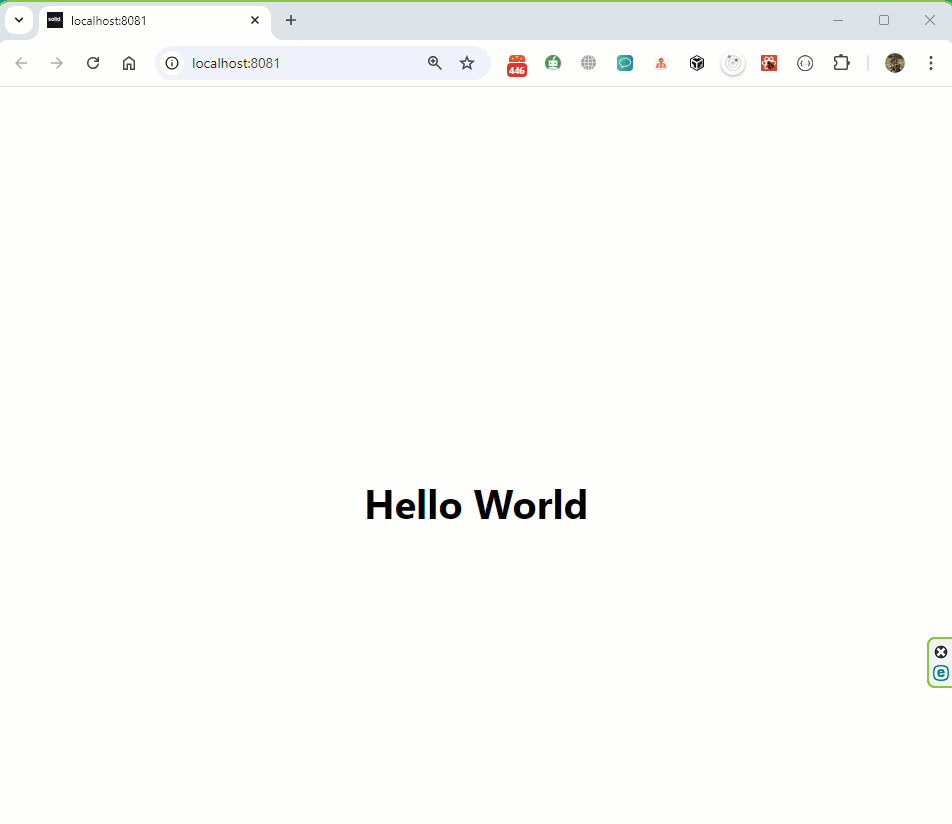

## Test task:

1. Create a test application using Expo Web
2. The application should: display the text "Hello there" in the middle of the screen and after tapping anywhere on the screen, a background color should be changed to a randomly generated color. You can also add any other feature to the app - that adds bonus points
3. Please do not use any external libraries for color generation
4. Don't use any "AI tools" like ChatGPT or similar.
5. Push code to GitHub
6. Send the link to the GitHub repository back

---

### Branch MAIN contains Web version of the application 

---

### Branch ANDROID contains version of the application for devices based on Android/iOS

---

### Tech Stack

- [React Native](https://reactnative.dev/)
- [Expo Go](https://docs.expo.dev/)
- [NativeWind](https://www.nativewind.dev/) - NativeWind uses Tailwind CSS as scripting language to create a universal style system for React Native. NativeWind components can be shared between platforms and will output their styles as CSS StyleSheet on web and StyleSheet.create for native.
- [Expo Font](https://docs.expo.dev/versions/latest/sdk/font/) 
- [Expo Router](https://docs.expo.dev/router/introduction/)
- [Expo Vector Icons](https://docs.expo.dev/guides/icons/)
- [TypeScript](https://www.typescriptlang.org/) 
- [ESLint](https://eslint.org/)
- [Prettier](https://prettier.io/)

##### Contact with me:

[][linkedin]

[linkedin]: https://www.linkedin.com/in/sergiy-antonyuk/